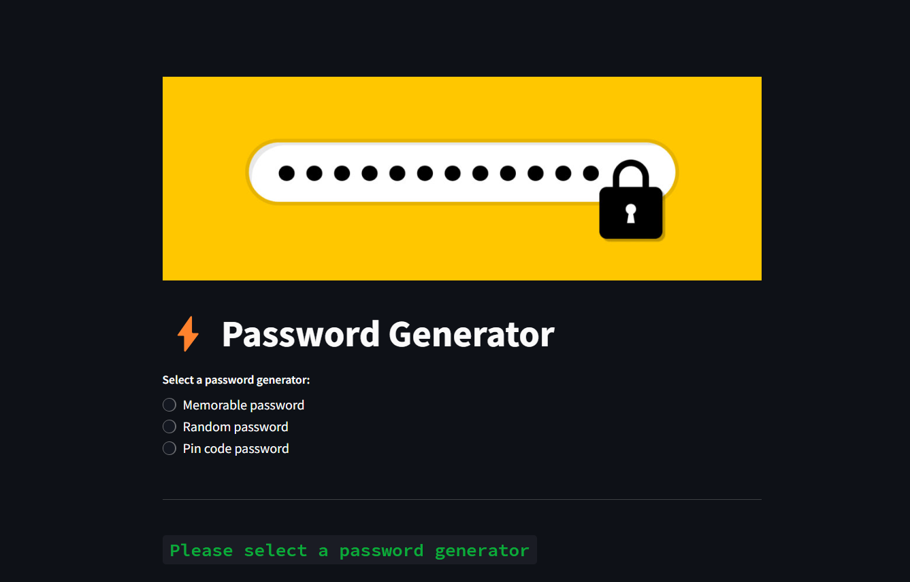

# Password Generator Dashboard

welcome to the 'Password Generator Dashboard' project with streamlit. In this web application you generate different type of password. It has three password generator including `RandomPasswordGenerator`, `MemorablePasswordGenerator`, and `PinCodeGenerator`. You can find these classes in password_generator.py module.



## Project Structure

```
password_generator_dashboard
|
|- images -> banner.png ...
|
|- src
|   |- app.py
|   |- password_generator.py
|- README.md
|- requirements.txt
```

## Requirements
- Python 3.7+
- nltk (Natural Language Toolkit)
- Steamlit

Install the dependencies:
```bash
pip install -r requirements.txt
```

after installing nltk you need to download 'Words' corpus. Run Python and type these commands:
```python
import nltk
nltk.download("words")
```
## Usage
After installing the requirements you can run the program with this command:

```bash
streamlit run src/app.py
```
It will run the web page at the localhost.
> it is better to run this command in the root directory of the project.

If you are using Linux or WSL or Mac you need to add the src path to the Python path with this command:
```bash
export PYTHONPATH=$PYTHONPATH:$(pwd)
```
> Run this command in the root directory of the project.

## Project requirements

### RandomPasswordGenerator:
This class should generate a random password of a specified length. It gives users the option to include numbers and symbols in their password.

### MemorablePasswordGenerator:
Generates a memorable password by combining a certain number of words together. Users can specify the separator, whether words should be capitalized, and provide their own list of vocabulary if they want.

### PinCodeGenerator:
Generates a numeric pin of the specified length.

For all the above, users should be given the functionality to choose the type of password they want and to customize it further based on their choices. A good user interface is a key aspect of this project!

Good luck and happy coding!
